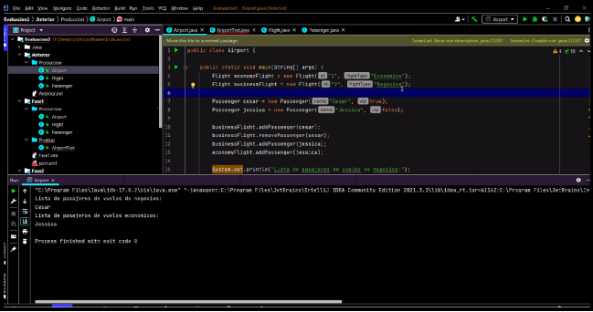
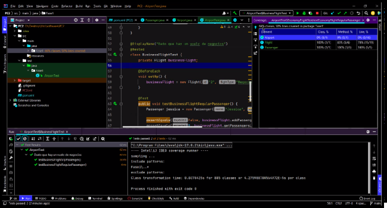
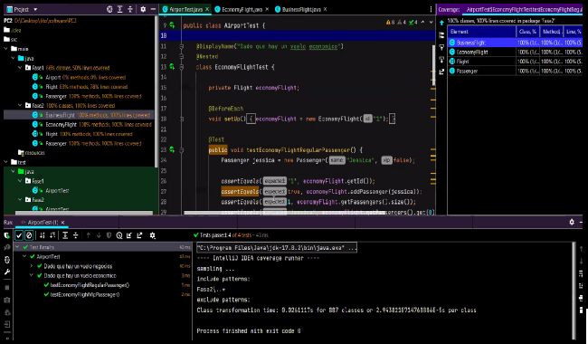
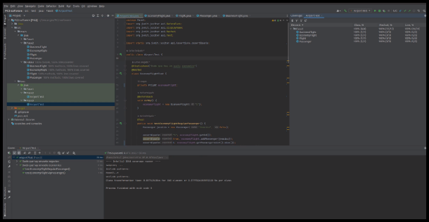
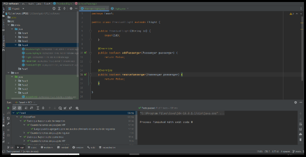
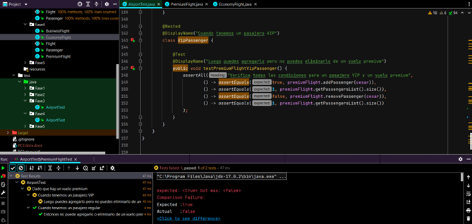
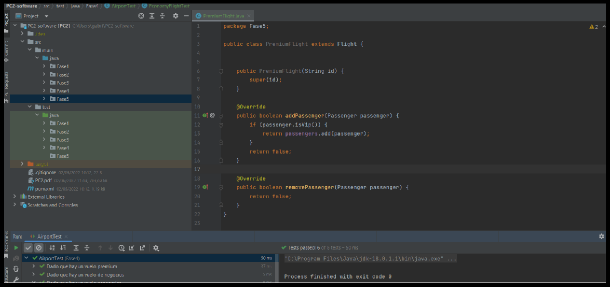
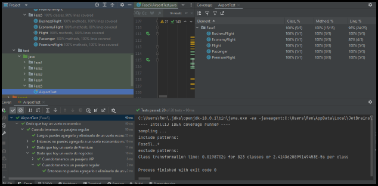

# PC2-software

## Ejecuta el programa y presenta los resultados y explica que sucede.
Se inicializa 2 objetos de la clase Flight y 2 objetos de la clase Passenger, según la instancia de los objetos de la clase creada, se agrega los pasajeros de forma
indiscriminada y de acuerdo con el valor del atributo de los pasajeros vip se ejecutan los métodos de la clase Flight.

## Pregunta 1
### ¿Cuáles son los resultados que se muestran? ¿Por qué crees que la cobertura del código no es del 100%?
Se muestra que el código de cobertura tiene un 66%, porque se está testeando solamente dos de las tres clases que están codificados.

## Pregunta 2
### ¿Por qué John tiene la necesidad de refactorizar la aplicación?
Porque cada vez que se cree un objeto de la clase Flight, debemos especificar su tipo de vuelo para poder hacer uso sus métodos, que tienen condicionales dentro para cada tipo de vuelo.
Si hacemos uso de 2 clases distintas BusinessFlight y EconomyFlight que heredan de la clase Flight, eliminaremos esta condicional en el método y cada clase tendrán sus métodos específicos de addPassenger y removePassenger

### Revisa la Fase 2 de la evaluación y realiza la ejecución del programa y analiza los resultados.
En la fase 2, se implementó una clase abstracta Flight donde se ve la inicialización de un ArrayList de tipo Passengers y las firmas de los métodos a utilizar, luego se extendió esta clase para crear 2 clases nuevas (BusinessFlight y EconomyFlight) y hacer uso del polimorfismo 

## Pregunta 3
### ¿Cuál es la cobertura del código?
100 %

### ¿La refactorización de la aplicación TDD ayudó tanto a mejorar la calidad del código?

Sí, porque se fue más específico con los nombres de las clases.

## Pregunta 4
### ¿En qué consiste está regla relacionada a la refactorización? Evita utilizar y copiar respuestas de internet. Explica cómo se relaciona al problema dado en la evaluación.

La Regla de Tres aplicada en la programación especifica que cuando se tiene una pieza de código la cual se repite 3 veces, se tiene que refactorizar para así facilitar la visualización y mantenimiento del código. \
En este caso se crea una nueva clase Premium Flight con el objetivo de evitar repetición.

## Pregunta 5
###     Escribe el diseño inicial de la clase llamada PremiumFlight y agrega a la Fase 4 en la carpeta producción.

## Pregunta 6
### Ayuda a John e implementa las pruebas de acuerdo con la lógica comercial de vuelos premium de las figuras anteriores. Adjunta tu código en la parte que se indica en el código de la Fase 4. Después de escribir las pruebas, John las ejecuta.

## Pregunta 7
### Agrega la lógica comercial solo para pasajeros VIP en la clase PremiumFlight. Guarda ese archivo en la carpeta Producción de la Fase 5.

## Pregunta 8
### Ayuda a John a crear una nueva prueba para verificar que un pasajero solo se puede agregar una vez a un vuelo. La ejecución de las pruebas ahora es exitosa, con una cobertura de código del 100 %. John ha implementado esta nueva característica en estilo TDD.

